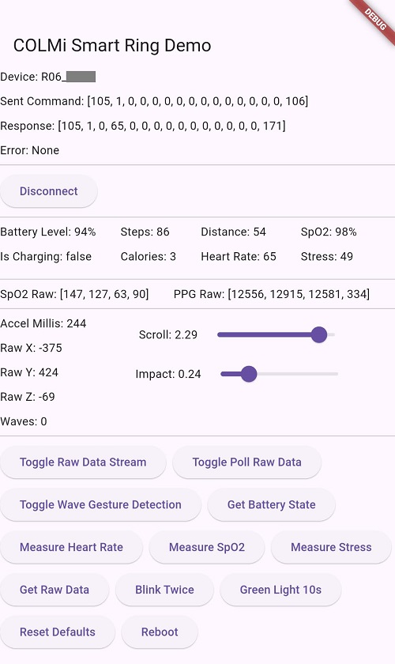

# colmi_r06_fbp

Reads and writes data to and from COLMi R02-R06 (BlueX RF03 SoC) Smart Rings using flutter_blue_plus.
Please note that some R02 rings may contain other SoCs and firmware and will not be compatible.

(Built for Android and iOS but only Android has been tested.)

### Screenshot

